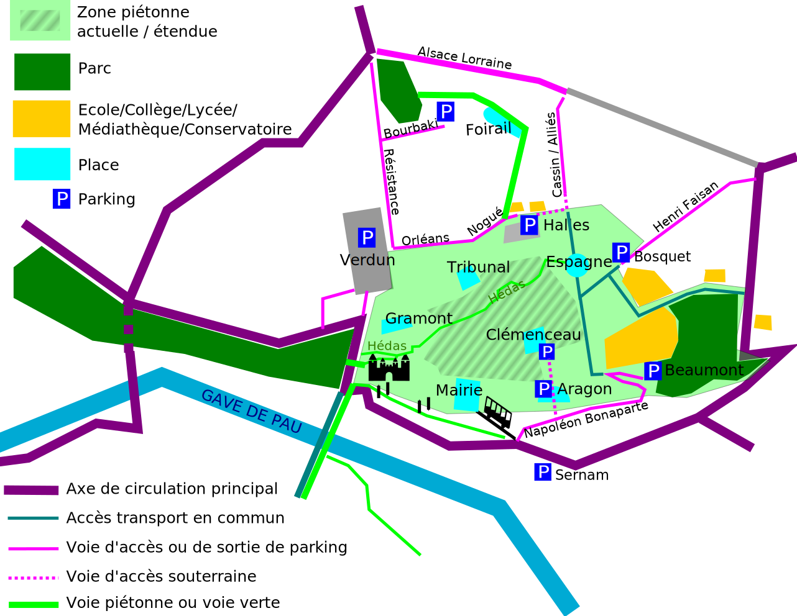

A deux pas des Halles et de la Médiathèque, venez vivre le rêve de la rue Castetnau accueillante, pour les enfants et pour tous.

<!--more-->

Badminton, molky, ping pong, jeux en bois, maquilleuses, vélos, boccia, poterie, jardinage, expos, dessins, musiques, contes...
Et aussi bien sûr, vos jeux d'extérieur, de société, vos enfants, crayons de couleurs et bonne humeur !

**Entre 10h et 19h, la circulation et le stationnement seront interdits le long de la rue Castetnau, entre la rue Despourrin et la rue Lespy. En lieu et place, vous trouverez des animations pour petits et grands.**

#### Au programme :

**Toute la journée**
* Jeux de balles/ de raquettes/ molki
* Atelier jardinage/compost
* Atelier dessin/craie sur feuille, sur bitume et sur panneaux
* Atelier réparation vélo (10h-17h)
* Jeux de constructions (jusqu'à 18h) par l'association "Parents en mouvements".
* Boccia avec l'association HandiSport
* Coin draisienne et mini vélos pour les petits.
* Porteur de parole
* Expo des slogans préparés par le périscolaire de l'école Henri IV
* Expo "rue de l'avenir"
* Exposition de peintures du "Seuil de l'art".

**L'après-midi**
* 14h-19h : Maquillage pour enfants
* 15h-19h : Atelier poterie

**Interventions ponctuelles**
* 11h-11h45 : Conte musical *la ville extraordinaire*, par la compagnie « Mon P'tit Guidon »
* 14h-15h30 : Musique par le centre des musiques actuelles (CMA)
* 15h30 : Remise du label *Rues aux enfants, Rue pour tous*, par l'association « Rue de l'Avenir ».
* 16h-17h : Musique par l'Orchestre de jeune « El Camino »
* 16h30-17h30 : Rythmique brésilienne par la Batucada « l'Étoile Métisse »
* 18h-18h45 : Conte musical *la ville extraordinaire*, par la compagnie « Mon P'tit Guidon »

La « _rue aux enfants, rue pour tous_ » est un évènement ponctuel, régulier, ou définitif, qui invite à repenser notre espace public. La place qui y est actuellement dévolue à la circulation et au stationnement motorisé rend cet espace inhospitalier pour les enfants et pour la vie de proximité. Lors de cet évènement, l'espace est donc rendu à ceux à qui il a été confisqué, lui donnant un visage totalement différent.

La rue Castetnau, centrale et riche de commerces, proche de pôles de vie importants, est une rue que notre association propose[^1] d'inclure dans une extension de la zone piétonne paloise (voir carte ci-dessous). C'est un lieu idéal pour ce type d'évènement.

Quoi qu'elle ne partage pas encore notre ambition de piétonisation, la mairie de Pau est notre partenaire dans l'organisation de cet évènement du 14 mai rue Castetnau. Il s'agit d'un projet festif, ouvert à tous, et qui implique de nombreux partenaires du quartier et de la ville.

[^1]: Vous pouvez consulter nos autres propositions pour la ville de Pau dans [notre manifeste](https://municipales2020.parlons-velo.fr/manifeste/download/24880).
