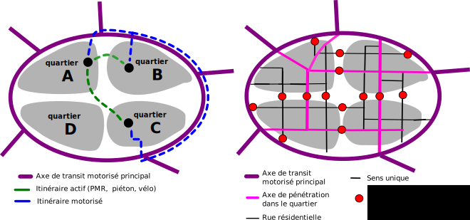

Nous traitons ici les sujets qui font la différence entre les candidats ayant répondu à notre questionnaire, en présentant à chaque fois en premier les candidats ayant les actes les plus favorables aux mobilités actives. Vous pouvez consulter les réponses intégrales des candidats en bas de [la page dédiée à Pau sur le site "Parlons Vélo"]. Pour mieux comprendre nos ambitions, consultez aussi [notre manifeste pour Pau], les images de cet article en sont extraites.

<!--more--> 

### Rédaction et argumentation des réponses

M. Blanco, M. Bayrou, M. Marbot, et M. Bouzon se démarquent par un vrai travail de réponse avec analyse et commentaire de nos propositions, les réponses de M. Bartoloméo et de M. Damour manquent de commentaires et d'argumentations pour les apprécier pleinement. M. Marconi n'a pas répondu au questionnaire, nous ne pouvons analyser sa position dans cet article.

### Présence au grand oral du vélo

1. M. Blanco, M. Marbot, M. Damour étaient présents.
2. M. Bayrou était absent mais représenté par M. Bertonazzi.
3. M. Bouzon était indisponible et ne pouvais se faire représenter, mais nous avait fourni un texte que nous avons pu lire.
4. M. Bartoloméo pensait pouvoir combiner la présence à deux évènements dans la soirée et s'est retrouvé à ne pas pouvoir assister à notre oral, ni s'y faire représenter.

### Quantité d'engagement pris

M.Blanco affiche un très fort volontarisme y compris sur les actions les plus ambitieuses et emblématiques, qui amènerait un vrai changement du visage de notre ville. Si on tient compte des réserves émises dans les commentaires, ils sont suivis par M. Marbot, M. Damour et M. Bartoloméo qui n'ont pas osé s'engager sans réserve sur certaines de ces actions fortes. M. Bayrou et M. Bouzon sont clairement à la traine sur le nombre d'engagements pris. **Nous constatons que le nombre d'engagement pris sans réserve, associé au niveau d'argumentation des réponses est un bon indicateur du degré d'implication des candidats dans les mobilités actives. Notre analyse des réponses ne remet pas en question le classement des candidats suivant ce critère.**.

### Exemplarité de l'élu dans ses déplacements

Grosse lacune de M. Bayrou sur cet engagement qu'il est seul à refuser. C'est pourtant un élément important d'une politique forte en faveur des mobilités actives, car la valeur d'exemple est inspirante pour tous les palois. Mais aussi, l'usage des mobilités actives par le chef de l'éxécutif est une forme de garantie de vraie volonté politique sur ce sujet.

### Budget

C'est un élément important pour quantifier l'engagement effectif en faveur des mobilités actives. Les listes de M. Blanco, M. Marbot et M. Bayrou on pris cet engagement. M. Damour met la réserve du budget qu'il découvrira pour Pau, sans préciser de seuil clair ou de pourcentage du budget qu'il est prêt à mettre, ce qui limite la portée de son engagement. Les listes de M. Bartoloméo, et de M. Bouzon n'ont pas su prendre cet engagement, ce qui est regrettable.

### Plan de circulation.

C'est un élément essentiel de notre plan d'action, qui permet d'apaiser la ville et de la rendre cyclable sans gros travaux d'aménagements, en faisant peser une contrainte explicite sur les déplacements automobiles (sans jamais les rendre impossibles). L'exemple de plan de circulation fournit en annexe de notre manifeste montre bien les restrictions importantes proposées pour canaliser le transit sur les grands axes. Sur ce point, tout les candidats se sont engagés, mais les commentaires et les recoupements avec les autres questions nous permettent de les différencier.

1. M. Blanco s'engage et semble avoir compris l'enjeu, car il précise bien que la contrainte sur les déplacement automobile ne devra pas s'appliquer au transport d'urgence ni au transport public.
2. M. Marbot s'engage mais avec une proposition différente qui pourrait finalement être complémentaire, à savoir la créations de zones de rencontre plutôt que d'impasses débouchantes, et précise bien que les voies les plus rapides peuvent se limiter à certains axes routiers desservant les autres mobilités et les parkings relais.
3. M. Damour et M. Bartoloméo s'engagent sans commentaire.
4. M. Bouzon s'engage sur une concertation, et ne veut pas de rupture, ce qui limite la portée de l'engagement.
5. M. Bayrou s'engage sans commentaire, mais en parallèle manque d'ambition sur la limitation à 30km/h dans tous les quartiers, qui va pourtant de pair avec le plan de circulation, ce qui pose la question de sa compréhension de l'ambition de cette proposition.

### Pistes sur les grands axes et Réseau Express Vélo

_Vue du boulevard Tourasse réaménagé_

Tout le monde s'engage :-)

Cepedant, cet engagement est à mettre en perspective avec les engagements budgétaires, qui seront forcément nécessaires pour assurer ce volet. Pour M. Bouzon, M. Bartoloméo et M. Damour, il est donc à prendre avec des pincettes.

### Connexion des deux rives

Sur ce sujet nous avons proposé le pont du 14 juillet sans voiture, et la réponse à cette proposition révèlent la préoccupation des candidats pour cette connexion.

1. M. Blanco ne s'engage pas sur notre proposition, mais propose a proposé une procédure d'essai et d'accompagnement similaire à celle du pont de Pierre à Bordeaux lors du Grand Oral
2. M. Marbot ne s'engage pas, mais propose des solutions alternatives (circulation alternée ou nouvelle passerelle) et marque une vrai volonté de réaliser la connexion entre les deux rives pour les mobilités douces
3. M. Damour s'engage sous réserve d'une enquête auprès des habitants du 14 juillet, et ne propose pas d'alternative si cette enquête abouti à un refus. Nous supposons cependant que cette enquête saura mettre en lumière des alternatives pour cette connexions.
4. M. Bouzon s'engage pour tester en commençant par des jours fériés et dimanche suivi d'un référendum, mais ne propose rien pour assurer la connexion des mobilités actives entre les deux rives si le référendum échoue. Un essai limité aux jours fériés nous semble peu pertinent, il faut plusieurs mois en continu pour mesurer les impacts et permettre aux nouvelles habitudes de se mettre en place.
5. M. Bayrou se contente de remplacer le muret par une grille pour gagner un peu de largeur pour les mobilités actives. Sans réduire la place motorisée sur ce pont, ou sans création de nouvelle voie pour les mobilités actives, la réponse de Bayrou n'est pas 
6. M. Bartoloméo ne s'engage pas, et ne propose rien dans les commentaires.

### Extension de la zone piétonne

[schéma de la zone piétonne](zone-pietonne.svg)

1. M. Damour et M. Bartoloméo s'engagent sans commentaire
2. M. Blanco s'engage, mais ne valide pas complètement les contours proposés et semble incertains sur la refonte de l'accès à Clémenceau et Aragon
3. M. Marbot propose une alternative moins ambitieuse, avec une combinaison de zones piétonnes et de zones de rencontre, dont la cartographie n'est pas fournie
4. M. Bouzon s'engage sur une concertation avec les habitants, ce qui limite la portée de l'engagement
5. M. Bayrou envisage la piétonisation de la place royale. Il indique que l'extension de la zone que nous proposons ne peut se faire sans étude et concertation, mais n'indique pas sa volonté de mener les études et la concertation.

### Les autres absences d'engagement:

M. Bouzon reste dans la logique de faire de la place au vélo s'il y en a, plutôt que de faire de la place à la voiture si c'est possible. Le refus de la  généralisation des double sens cyclables, des cédez le passage cyclistes et sas vélo, ainsi que l'identification des axes "danger vélo" relèvent de cette logique.

Sur certains sujet, M. Bouzon et M. Bayrou semblent préfèrer subir la nuisance de la circulation motorisée ou de l'abscence d'équipement du "système vélo" plutôt que de poser des contraintes.

- M. Bouzon refuse : restreindre la circulation aux abords des écoles aux heures d'entrée/sortie, l'obligation de système de détection pour les angles morts des poids lourds en ville, la création de stationnement vélo en remplacement des stationnements voiture en amont des passages piétons (pour améliorer la visibilité, la loi LOM ayant déjà acté que le stationnement voiture sera interdit à ces endroits), l'obligation réglementaire de stationnement vélo dans les constructions neuves, la mesure et les objectifs de part modale, l'incitation des entreprises (notre proposition d'action ne relevait pourtant pas de la contrainte mais de l'aide et de l'accompagnement)
- M. Bayrou refuse : la généralisation de la limitation à 30km/h en dehors des grands axes, la journée sans voiture, l'obligation de système de détection pour les angles morts des poids lourds en ville, l'obligation réglementaire de stationnement vélo dans les constructions neuves.

Sur d'autres sujets enfin, M. Bouzon et M. Bayrou refusent d'investir dans l'aide au changement des modes de déplacement

- M. Bouzon rejette la prise d'initiative sur d'autres acteurs : pour la logistique vélo (rejeté sur les entreprises), aide à l'achat (les acheteurs se débrouillent),  pour les pédibus et vélobus (rejeté sur les parents)
- M. Bayrou refuse : l'aide à l'achat de vélo (ce refus vient se cumuler au refus actuel d'augmenter l'offre de vélo en location longue durée qui est débordée par son succès); l'incitation aux entreprises par des remises de prix ou des offres de location spécifique sur site.

M. Damour ne s'engage pas sur les compteurs publiques de passage vélo, nous avons du mal à comprendre ce refus sur un sujet qui semble relativement simple au vu du reste des engagements.

[notre questionnaire en ligne]: https://municipales2020.parlons-velo.fr/q/24880
[notre manifeste pour Pau]: https://municipales2020.parlons-velo.fr/manifeste/download/Pau
[la page dédiée à Pau sur le site "Parlons Vélo"]: https://municipales2020.parlons-velo.fr/e/24880
