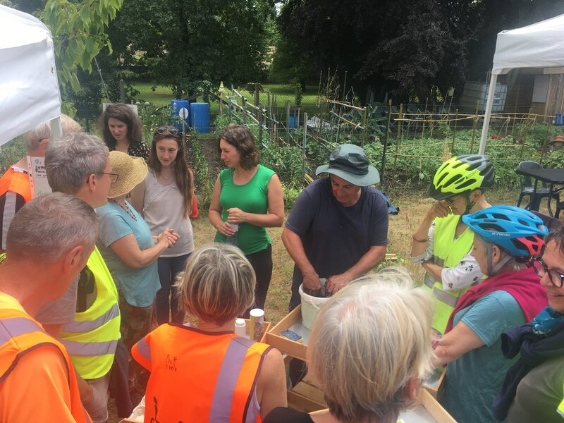

A l'occasion de la fête des jardins, notre association vous proposait une balade sur la journée à travers différents jardins participatifs de la ville de Pau: jardipotes, carr'hédas, l'improbable jardin, jardins de Marsan, jardin Guynemer... L'occasion de découvrir ces différents lieux, et ceux qui les animent. Notre pique nique s'est fait au jardin de Marsan.

Le plan du parcours sous forme d'image :



Vous pouvez aussi télécharger [la trace gpx](parcours-jardins.gpx)
