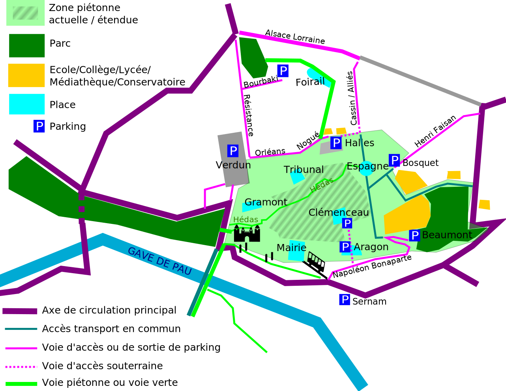

Dans la vie de tous les jours, la rue Castetnau de Pau, c'est **quatre files de voitures** (deux pour le stationnement et deux pour la circulation), et des **tout petits trottoirs** qui bordent de nombreux commerces, à deux pas des halles et de la médiathèque. On y voit régulièrement circuler des poids lourds. 

A pied, ne faire qu'y passer est désagréable. A vélo c'est le même ressenti, auquel s'ajoute facilement un sentiment d'insécurité. Si on s'y arrête pour discuter avec quelqu'un, le plaisir de la rencontre est gâché par cet **environnement hostile, bruyant, et à l'espace très limité**. En voiture, on y est confronté aux afres de la ville : feux, ralentissements, nombreux croisements à gérer, place impossible à trouver. Cette rue ne fait rêver personne.

.

Cette rue hyper-centrale fait partie de **l'extension de la zone piétonne revendiquée par notre association**, pour une ville qui soit plus agréable à vivre, et plus facile à pratiquer à pied ou à vélo. Ses abords sont déjà très bien desservis par les transports en commun.

*Extension de la zone piétonne revendiquée par l'association "Pau à Vélo"*

Pour ceux qui devront absolument s'y rendre en voiture, il sera aisé de stationner dans le **parking République à deux pas**, et le parking **Bosquet également tout proche**. Pour les livraisons des commerces, une rue piétonne est beaucoup plus praticable, même si les horaires y sont contraints. En dehors de ces horaires, **la livraison en vélo cargo** restera possible. Pour ceux qui ne font que passer par là sans vouloir s'y arrêter, il deviendra indispensable de contourner cette zone et d'emprunter des axes capables de supporter un trafic important.

Ce samedi 14 mai, en collaboration avec la ville et de nombreux partenaires, l'association Pau à Vélo a remplacé les files de voitures de la rue Castetnau par **des animations pour les petits et les grands**, rendant ainsi cette portion d'espace public à tous ceux à qui il est habituellement confisqué, à commencer par les enfants.  L'évènement a volontairement été placé **un jour habituel de forte affluence motorisée**, et il n'y a pas eu d'apocalypse de la circulation. Le public a pu constater le **changement radical d'ambiance**, dans une rue qui devenait enfin un lieu à vivre pour tous.

*La rue Castetnau comme d'habitude*

*Samedi 14 mai, la rue Castetnau comme nous la rêvons*

La ville, bien que partageant notre enthousiasme pour cet évènement festif et dynamique, ne partage pas encore notre ambition de piétonnisation. Espérons que l'expérience pourra être reproduite à l'avenir, et que notre revendication fera son chemin dans le coeur du public et des élus. A l'heure de l'urgence climatique, il s'agit d'une proposition de bon sens. Nos mobilités doivent changer, notre ville doit évoluer.

### Retour en image sur cet évènement marquant



#### Petits vélos, ping pong, molki



#### Peinture, construction, maquillage



*L'atelier de construction était proposé par l'association "Parents en mouvement"*

#### Expo, spectacle



* *Exposition de peinture par l'atelier du Seuil de l'art.*
* *Conte en musique par la compagnie "Mon ptit guidon".*
* *Musique par* 
    * *le Centre des Musiques Actuelles (CMA),*
    * *l'orchestre de jeune "El Camino"*,
    * *la batucada "L'étoile Métisse".*

#### Massages assis, Atelier Vélo



#### Slogans et dessins sur la rue



#### Notre [**pétition contre le parking bourbaki**](https://www.change.org/p/non-au-parking-bourbaki-oui-%C3%A0-une-ville-durable)

#### Bénévoles



#### Remise du label "Rues aux enfants, rue pour tous"

*Remis par Caroline Bireau, de l'antenne régionale "Rue de l'avenir", et en présence de l'élu référent du centre ville, M. Gilbert Danan*

### Banderole géante

<iframe src="https://player.vimeo.com/video/712338491?h=816f9463b7&amp;badge=0&amp;autopause=0&amp;player_id=0&amp;app_id=58479" frameborder="0" allow="autoplay; fullscreen; picture-in-picture" allowfullscreen style="position:absolute;top:0;left:0;width:100%;height:100%;max-height:650px" title="Untitled"></iframe>

Cet évènement a fait l'objet d'[un article dans la République des Pyrénées](https://www.larepubliquedespyrenees.fr/pyrenees-atlantiques/pau/pau-ils-ont-teste-la-rue-castetnau-sans-voiture-10938050.php)

Photos de Gaëtan Portenard, courte échelle. Sauf : photos du jeu de molki, de la table de ping pong, du spectacle musical de la compagnie "mon ptit guidon"

